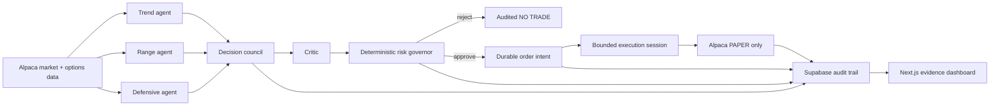

# ThesisCircuit

> **AI strategies compete. Risk decides. Sometimes the best trade is no trade.**

ThesisCircuit is an autonomous options research and paper-execution system built for the Alpaca AI Trading Agents Hackathon. Three deterministic strategy agents independently interpret live Alpaca market and options data, a critic challenges their assumptions, and a fail-closed risk governor decides whether any proposal can advance. Every decision is preserved as an auditable event.

- **Live dashboard:** https://thesiscircuit.vercel.app/
- **Production API:** https://thesiscircuit-production.up.railway.app/
- **Public source:** https://github.com/kmt9967/thesiscircuit

## Why it matters

Most trading-agent demos optimize for generating a trade. ThesisCircuit optimizes for making a defensible decision. It separates research, risk approval, durable broker intent, and execution authority so an agent cannot talk its way around a rejection. No-trade outcomes are first-class results rather than failures.

## How it works



The agent arena produces structured theses instead of free-form orders. The council and critic expose agreement and objections. The risk layer applies deterministic checks for paper mode, endpoint safety, freshness, liquidity, buying power, bounded loss, conflicts, idempotency, and session budgets. Supabase locking prevents overlapping cycles and duplicate claims. Execution is impossible unless separate server-side gates and an expiring session all agree.

## Verified Alpaca PAPER result

On September 2, 2026, ThesisCircuit proved the full pipeline with one deliberately small opening order in the dedicated $100,000 judging PAPER account:

| Item | Alpaca-reported result |
| --- | --- |
| Contract | `SPY260904C00768000` — SPY Sep 4, 2026 $768 call |
| Strategy | One long call; premium-bounded risk |
| Order | Buy to open 1 contract, DAY limit at $1.88 |
| Fill | 1 contract at $1.84 |
| Maximum planned premium risk | $188 |
| Additional or closing orders | 0 |

At the final production observation on September 3 at 22:47 UTC, Alpaca reported account equity of **$100,397.94**, cash of **$99,815.94**, one open paper position, no open orders, and one historical order. The dashboard labels this state **ACTUAL ALPACA PAPER RESULTS**. These values are a timestamped paper-account observation, not a promise of final scoring or future performance.

## What makes it different

- **Risk has final authority.** LLM-style rationale cannot override a deterministic rejection.
- **NO TRADE is observable.** Rejected ideas, critic objections, shadow outcomes, and counterfactuals remain visible without being misrepresented as broker activity.
- **Broker writes are durable.** Atomic intent claims, reconciliation-before-retry, cycle locks, and conservative UNKNOWN-state accounting protect against duplicate orders.
- **Autonomy is bounded.** Sessions expire, order budgets are atomic, terminal outcomes force execution flags off, and no frontend control can enable trading.
- **Paper-only by construction.** The only accepted broker host is `paper-api.alpaca.markets`; live configuration fails closed.

## Alpaca integration

The backend uses the official `alpaca-py` SDK for paper account, market clock, option-contract, quote, order, and position data. Application-owned deterministic services wrap the SDK so timestamps, malformed responses, timeouts, and uncertain submissions are handled consistently. On a submission timeout, ThesisCircuit reconciles by the unique `client_order_id` before any retry. The official competition FAQ permits an official SDK when its use is explained; ThesisCircuit prioritizes `alpaca-py` because typed SDK responses sit behind its audited, transactional safety boundary.

## Current capability status

| Capability | Status |
| --- | --- |
| Live Alpaca PAPER account and options data | **VERIFIED** |
| One controlled end-to-end PAPER opening order | **VERIFIED** |
| Supabase audit, locking, durable intents, and session budgets | **VERIFIED** |
| Strategy arena, critic, risk vetoes, replay, and shadow analysis | **VERIFIED** |
| Production bounded-session activation and shutdown | **SYNTHETICALLY VERIFIED** with 0 broker calls |
| Autonomous broker execution | **NOT ACTIVATED** |
| Live trading | **PROHIBITED / NOT CREATED** |

Production rests with `EXECUTION_ENABLED=false`, `AUTONOMOUS_TRADING_ENABLED=false`, `ALLOW_LIVE_TRADING=false`, `TRADING_MODE=paper`, and `ALPACA_PAPER_TRADE=true`.

## Reliability and evidence

The repository includes replay fixtures, database migrations, fail-closed configuration tests, eight-worker atomic-claim and budget races, restart recovery, stale-lock expiry, uncertain-order reconciliation, browser checks, and sanitized production evidence. The final validation suite passes **256 backend tests**, Ruff, Python compilation, frontend typecheck, UI checks, production build, tracked-secret scanning, live-endpoint scanning, and the paper-safety audit.

- [One-page submission write-up](submission/ONE-PAGE-WRITEUP.md)
- [Alpaca technical story](docs/ALPACA-TECH-STORY.md)
- [Phase 1 execution record](docs/PHASE-1-EXECUTION.md)
- [Phase 2 architecture](docs/PHASE-2-ARCHITECTURE.md)
- [Risk policy](docs/RISK-POLICY.md)
- [Sanitized final evidence](evidence/final-submission/README.md)

## Run locally

```powershell
python -m venv .venv
.\.venv\Scripts\Activate.ps1
python -m pip install -e ".[dev]"
python -m uvicorn backend.app.main:app --reload --port 8000
```

In another terminal:

```powershell
cd frontend
npm install
npm run dev
```

Validate from the repository root:

```powershell
.\.venv\Scripts\python.exe -m pytest
.\.venv\Scripts\python.exe -m ruff check .
.\.venv\Scripts\python.exe scripts/safety_audit.py
.\.venv\Scripts\python.exe scripts/secret_scan.py
cd frontend
npm run lint
npm test
npm run build
```

## Disclosure

**SIMULATED PAPER TRADING — NO REAL FUNDS.** Results are hypothetical and are not investment advice. Options carry significant risk, and all investments involve risk. Repository and infrastructure scaffolding preceded parts of the official scoring window; the controlled order, autonomous architecture, production verification, and their timestamps are documented in Git history and sanitized evidence. No live brokerage account or live API credential was created.
